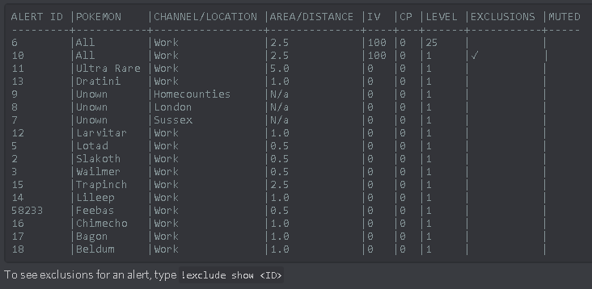

***************************
Showing Alerts & Exclusions
***************************

Contents:

1. Viewing Alerts
2. Viewing Exclusions

1. Viewing Filters

!alert show

Shows a list of alerts. It’s the go-to to see what’s going on with filters. Example:

	
!alert show name
!alert show number

Shows a list of filters, sorted by name or by (dex) number.

If you alerts have exclusions, you can view these by typing:

!exclude show <ID>
