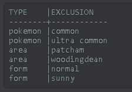

Showing Alerts & Exclusions
===========================

.. contents:: :local:

Viewing Filters
---------------

.. code-block:: bash

    !alert show

Shows a list of alerts, sorted by pokedex number. It’s the go-to to see what’s going on with your alerts. Example:

.. image:: alert_show.PNG

There are a few extra sorting options for this command (always in ascending order):

.. code-block:: bash

    !alert show name        Returns a list sorted by Pokemon Name   
    !alert show channel     Returns a list sorted by Channel
    !alert show area        Returns a list sorted by Area
	
Viewing Exclusions
------------------

If you alerts have exclusions (indicated by a ✓ in the exclusions column, you can view these by typing:

.. code-block:: bash

    !exclude show <ID>
	
